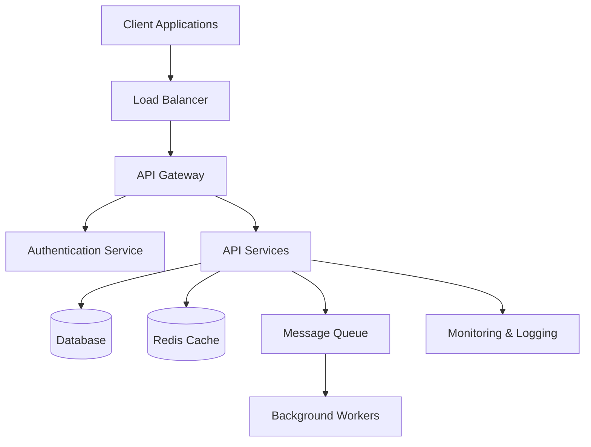
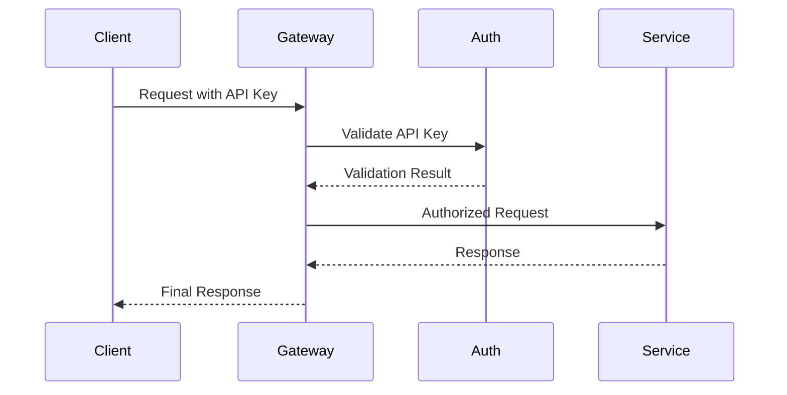

## Overview

HolySuck API is built on a modern, scalable architecture designed to handle millions of requests while maintaining low latency and high availability.

## System Architecture



## Core Components

### API Gateway

The API Gateway serves as the entry point for all requests:

- **Request Routing**: Routes requests to appropriate microservices
- **Rate Limiting**: Enforces rate limits per API key
- **Authentication**: Validates API keys and tokens
- **Request/Response Transformation**: Normalizes data formats
- **Monitoring**: Tracks metrics and performance

### Microservices

HolySuck is built using a microservices architecture:

#### User Service
- Manages user accounts and profiles
- Handles user authentication and authorization
- Stores user preferences and settings

#### Service Management
- Manages application services and configurations
- Handles service lifecycle operations
- Maintains service metadata and relationships

#### Analytics Service
- Processes usage metrics and analytics
- Generates reports and insights
- Handles real-time data aggregation

#### Webhook Service
- Manages webhook configurations
- Handles webhook delivery and retries
- Tracks delivery status and failures

### Data Layer

#### Primary Database (PostgreSQL)
- Stores core application data
- Ensures ACID compliance
- Handles complex queries and relationships

#### Cache Layer (Redis)
- Caches frequently accessed data
- Stores session information
- Handles rate limiting counters

#### Message Queue (Apache Kafka)
- Handles asynchronous processing
- Enables event-driven architecture
- Provides reliable message delivery

## Design Principles

### RESTful Design

HolySuck API follows REST architectural principles:

- **Resource-based URLs**: `/v1/users/123` not `/v1/getUser?id=123`
- **HTTP Methods**: Use appropriate verbs (GET, POST, PUT, DELETE)
- **Status Codes**: Meaningful HTTP status codes
- **Stateless**: Each request contains all necessary information

### Versioning Strategy

API versioning ensures backward compatibility:

```http
https://api.holysuck.com/v1/users
https://api.holysuck.com/v2/users
```

- **URL-based versioning**: Version included in the URL path
- **Backward compatibility**: Previous versions remain functional
- **Deprecation timeline**: 12-month deprecation notice for breaking changes

### Error Handling

Consistent error response format:

```json
{
  "error": "validation_failed",
  "message": "The request contains invalid parameters",
  "details": [
    {
      "field": "email",
      "code": "invalid_format",
      "message": "Email must be a valid email address"
    }
  ],
  "documentation_url": "https://docs.holysuck.com/errors/validation_failed"
}
```

### Pagination

Consistent pagination across all list endpoints:

```json
{
  "data": [...],
  "pagination": {
    "page": 1,
    "per_page": 20,
    "total": 100,
    "total_pages": 5,
    "has_more": true
  }
}
```

## Security Architecture

### Authentication Flow



### Security Layers

1. **Network Security**
   - TLS 1.3 encryption for all communications
   - DDoS protection and traffic filtering
   - IP whitelisting for sensitive operations

2. **Authentication & Authorization**
   - Multi-method authentication (API keys, OAuth, JWT)
   - Role-based access control (RBAC)
   - Scope-based permissions

3. **Data Protection**
   - Encryption at rest (AES-256)
   - Field-level encryption for sensitive data
   - Regular security audits and penetration testing

## Scalability Features

### Horizontal Scaling

- **Auto-scaling**: Automatic scaling based on traffic patterns
- **Load Distribution**: Intelligent request routing
- **Regional Deployment**: Multi-region support for global users

### Performance Optimization

- **Caching Strategy**: Multi-layer caching (CDN, Application, Database)
- **Database Optimization**: Read replicas and query optimization
- **Asynchronous Processing**: Background jobs for heavy operations

### Monitoring & Observability

#### Real-time Monitoring
- **Health Checks**: Continuous service health monitoring
- **Performance Metrics**: Response times, throughput, error rates
- **Resource Utilization**: CPU, memory, and storage monitoring

#### Logging & Tracing
- **Structured Logging**: JSON-formatted logs with correlation IDs
- **Distributed Tracing**: Request tracing across microservices
- **Error Tracking**: Automated error detection and alerting

## Data Flow

### Request Lifecycle

1. **Client Request**: Client sends request to API
2. **Gateway Processing**: Request validation and routing
3. **Authentication**: User/API key verification
4. **Service Processing**: Business logic execution
5. **Data Access**: Database or cache access
6. **Response Generation**: Format and return response

### Asynchronous Operations

For long-running operations, HolySuck uses asynchronous processing:

```json
{
  "job_id": "job_abc123",
  "status": "pending",
  "created_at": "2024-01-15T10:30:00Z",
  "callback_url": "https://api.holysuck.com/v1/jobs/job_abc123"
}
```

### Webhook Delivery

Event-driven notifications ensure real-time updates:

```json
{
  "event": "user.created",
  "data": {
    "user": {
      "id": "user_123",
      "email": "user@example.com"
    }
  },
  "timestamp": "2024-01-15T10:30:00Z",
  "webhook_id": "webhook_456"
}
```

## Reliability & Availability

### SLA Commitments

- **Uptime**: 99.9% availability SLA
- **Response Time**: < 200ms for 95% of requests
- **Data Durability**: 99.999999999% (11 9's)

### Disaster Recovery

- **Data Backup**: Automated daily backups with point-in-time recovery
- **Multi-Region Failover**: Automatic failover to backup regions
- **Recovery Time**: < 4 hours RTO, < 15 minutes RPO

### Circuit Breaker Pattern

Prevents cascade failures using circuit breakers:

```javascript
// Example circuit breaker implementation
if (errorRate > threshold) {
  return cachedResponse || fallbackResponse;
}
```

## API Evolution

### Backward Compatibility

- **Additive Changes**: New fields and endpoints don't break existing clients
- **Optional Parameters**: New parameters are optional by default
- **Deprecation Process**: 12-month notice for breaking changes

### Feature Flags

Feature flags enable safe deployment of new features:

```json
{
  "features": {
    "new_analytics_endpoint": {
      "enabled": true,
      "rollout_percentage": 10
    }
  }
}
```

This architecture ensures HolySuck API remains reliable, scalable, and maintainable while providing excellent developer experience.