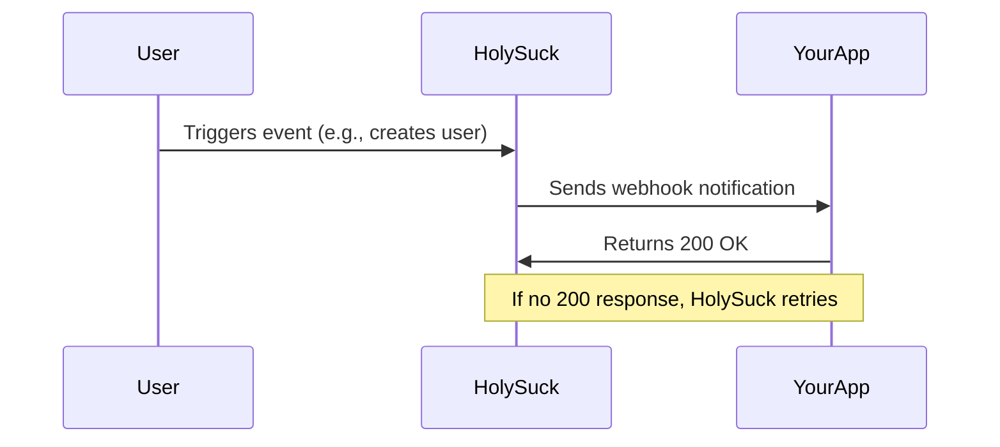

## Overview

Webhooks allow your application to receive real-time notifications when events occur in HolySuck. Instead of repeatedly polling our API for changes, webhooks push data to your application as events happen.

## How Webhooks Work



1. **Event Occurs**: Something happens in HolySuck (user created, service updated, etc.)
2. **Webhook Triggered**: HolySuck sends an HTTP POST request to your endpoint
3. **Your App Responds**: Your application processes the event and returns a 200 status
4. **Retry Logic**: If your app doesn't respond with 200, HolySuck retries the delivery

## Setting Up Webhooks

### 1. Create a Webhook Endpoint

First, create an endpoint in your application to receive webhooks:

<CodeGroup>

```javascript Express.js
const express = require('express');
const crypto = require('crypto');

const app = express();

// Important: Use raw body parser for webhooks
app.use('/webhooks', express.raw({ type: 'application/json' }));

app.post('/webhooks/holysuck', (req, res) => {
  const signature = req.headers['x-holysuck-signature'];
  const payload = req.body;
  const secret = process.env.HOLYSUCK_WEBHOOK_SECRET;
  
  // Verify the webhook signature
  if (!verifyWebhookSignature(payload, signature, secret)) {
    console.error('Invalid webhook signature');
    return res.status(401).send('Unauthorized');
  }
  
  try {
    const event = JSON.parse(payload);
    console.log('Received webhook:', event.event);
    
    // Process the event
    handleWebhookEvent(event);
    
    // Always respond with 200 to acknowledge receipt
    res.status(200).send('OK');
  } catch (error) {
    console.error('Webhook processing error:', error);
    res.status(500).send('Internal Server Error');
  }
});

function verifyWebhookSignature(payload, signature, secret) {
  const expectedSignature = crypto
    .createHmac('sha256', secret)
    .update(payload, 'utf8')
    .digest('hex');
  
  return signature === `sha256=${expectedSignature}`;
}

function handleWebhookEvent(event) {
  switch (event.event) {
    case 'user.created':
      handleUserCreated(event.data);
      break;
    case 'user.updated':
      handleUserUpdated(event.data);
      break;
    case 'user.deleted':
      handleUserDeleted(event.data);
      break;
    default:
      console.log('Unhandled event type:', event.event);
  }
}

app.listen(3000, () => {
  console.log('Webhook server listening on port 3000');
});
```

```python Flask
from flask import Flask, request, abort
import hmac
import hashlib
import json
import os

app = Flask(__name__)

@app.route('/webhooks/holysuck', methods=['POST'])
def handle_webhook():
    signature = request.headers.get('X-HolySuck-Signature')
    payload = request.get_data()
    secret = os.environ.get('HOLYSUCK_WEBHOOK_SECRET')
    
    # Verify signature
    if not verify_webhook_signature(payload, signature, secret):
        abort(401, 'Invalid signature')
    
    try:
        event = json.loads(payload)
        print(f"Received webhook: {event['event']}")
        
        # Process the event
        handle_webhook_event(event)
        
        return 'OK', 200
    except Exception as e:
        print(f"Webhook processing error: {e}")
        return 'Internal Server Error', 500

def verify_webhook_signature(payload, signature, secret):
    if not signature:
        return False
    
    expected_signature = hmac.new(
        secret.encode('utf-8'),
        payload,
        hashlib.sha256
    ).hexdigest()
    
    return signature == f'sha256={expected_signature}'

def handle_webhook_event(event):
    event_type = event['event']
    
    if event_type == 'user.created':
        handle_user_created(event['data'])
    elif event_type == 'user.updated':
        handle_user_updated(event['data'])
    elif event_type == 'user.deleted':
        handle_user_deleted(event['data'])
    else:
        print(f'Unhandled event type: {event_type}')

if __name__ == '__main__':
    app.run(port=3000)
```

```go Go
package main

import (
    "crypto/hmac"
    "crypto/sha256"
    "encoding/hex"
    "encoding/json"
    "fmt"
    "io"
    "log"
    "net/http"
    "os"
    "strings"
)

type WebhookEvent struct {
    Event     string                 `json:"event"`
    Data      map[string]interface{} `json:"data"`
    Timestamp string                 `json:"timestamp"`
    ID        string                 `json:"id"`
}

func webhookHandler(w http.ResponseWriter, r *http.Request) {
    if r.Method != http.MethodPost {
        http.Error(w, "Method not allowed", http.StatusMethodNotAllowed)
        return
    }
    
    signature := r.Header.Get("X-HolySuck-Signature")
    payload, err := io.ReadAll(r.Body)
    if err != nil {
        http.Error(w, "Failed to read body", http.StatusBadRequest)
        return
    }
    
    secret := os.Getenv("HOLYSUCK_WEBHOOK_SECRET")
    if !verifySignature(payload, signature, secret) {
        http.Error(w, "Invalid signature", http.StatusUnauthorized)
        return
    }
    
    var event WebhookEvent
    if err := json.Unmarshal(payload, &event); err != nil {
        http.Error(w, "Invalid JSON", http.StatusBadRequest)
        return
    }
    
    log.Printf("Received webhook: %s", event.Event)
    
    handleWebhookEvent(event)
    
    w.WriteHeader(http.StatusOK)
    w.Write([]byte("OK"))
}

func verifySignature(payload []byte, signature, secret string) bool {
    if signature == "" {
        return false
    }
    
    mac := hmac.New(sha256.New, []byte(secret))
    mac.Write(payload)
    expectedSignature := "sha256=" + hex.EncodeToString(mac.Sum(nil))
    
    return signature == expectedSignature
}

func handleWebhookEvent(event WebhookEvent) {
    switch event.Event {
    case "user.created":
        handleUserCreated(event.Data)
    case "user.updated":
        handleUserUpdated(event.Data)
    case "user.deleted":
        handleUserDeleted(event.Data)
    default:
        log.Printf("Unhandled event type: %s", event.Event)
    }
}

func main() {
    http.HandleFunc("/webhooks/holysuck", webhookHandler)
    
    fmt.Println("Webhook server listening on :3000")
    log.Fatal(http.ListenAndServe(":3000", nil))
}
```

</CodeGroup>

### 2. Register Your Webhook

Create a webhook configuration in HolySuck:

<CodeGroup>

```bash cURL
curl -X POST "https://api.holysuck.com/v1/webhooks" \
  -H "Authorization: Bearer YOUR_API_KEY" \
  -H "Content-Type: application/json" \
  -d '{
    "url": "https://yourapp.com/webhooks/holysuck",
    "events": [
      "user.created",
      "user.updated", 
      "user.deleted",
      "service.created",
      "service.updated"
    ],
    "secret": "your_webhook_secret_here"
  }'
```

```javascript JavaScript
const webhook = await fetch('https://api.holysuck.com/v1/webhooks', {
  method: 'POST',
  headers: {
    'Authorization': 'Bearer YOUR_API_KEY',
    'Content-Type': 'application/json'
  },
  body: JSON.stringify({
    url: 'https://yourapp.com/webhooks/holysuck',
    events: [
      'user.created',
      'user.updated',
      'user.deleted',
      'service.created',
      'service.updated'
    ],
    secret: process.env.WEBHOOK_SECRET
  })
});

const webhookConfig = await webhook.json();
console.log('Webhook created:', webhookConfig.id);
```

</CodeGroup>

## Event Types

HolySuck sends webhooks for the following events:

### User Events

| Event | Description | Triggered When |
|-------|-------------|----------------|
| `user.created` | New user account created | User registration or admin creation |
| `user.updated` | User profile updated | Name, role, status, or metadata changes |
| `user.deleted` | User account deleted | Account deletion or suspension |
| `user.login` | User logged in | Successful authentication |
| `user.logout` | User logged out | User session ended |

### Service Events

| Event | Description | Triggered When |
|-------|-------------|----------------|
| `service.created` | New service created | Service registration |
| `service.updated` | Service configuration updated | Settings, status, or metadata changes |
| `service.deleted` | Service removed | Service deletion |

### API Key Events

| Event | Description | Triggered When |
|-------|-------------|----------------|
| `api_key.created` | New API key generated | Key creation |
| `api_key.deleted` | API key revoked | Key deletion or expiration |

### Webhook Events

| Event | Description | Triggered When |
|-------|-------------|----------------|
| `webhook.delivery_failed` | Webhook delivery failed | After all retry attempts fail |

## Webhook Payload Structure

All webhooks follow this structure:

```json
{
  "event": "user.created",
  "data": {
    "user": {
      "id": "user_1234567890abcdef",
      "email": "user@example.com",
      "name": "John Doe",
      "status": "active",
      "role": "user",
      "created_at": "2024-01-20T15:30:00Z"
    }
  },
  "timestamp": "2024-01-20T15:30:00Z",
  "id": "evt_abcdef1234567890",
  "webhook_id": "webhook_9876543210fedcba"
}
```

### Common Fields

| Field | Type | Description |
|-------|------|-------------|
| `event` | string | The event type that triggered the webhook |
| `data` | object | Event-specific data payload |
| `timestamp` | string | ISO 8601 timestamp when the event occurred |
| `id` | string | Unique event identifier |
| `webhook_id` | string | ID of the webhook configuration |

## Security

### Signature Verification

HolySuck signs all webhook payloads with HMAC-SHA256:

```javascript
function verifyWebhookSignature(payload, signature, secret) {
  const crypto = require('crypto');
  
  const expectedSignature = crypto
    .createHmac('sha256', secret)
    .update(payload, 'utf8')
    .digest('hex');
  
  // Use timing-safe comparison
  return crypto.timingSafeEqual(
    Buffer.from(signature.replace('sha256=', ''), 'hex'),
    Buffer.from(expectedSignature, 'hex')
  );
}
```

### Best Practices

<Accordion title="Use HTTPS">
Always use HTTPS endpoints for webhooks to protect data in transit:

```javascript
// ✅ Good
const webhookUrl = 'https://yourapp.com/webhooks/holysuck';

// ❌ Bad - HTTP is not secure
const webhookUrl = 'http://yourapp.com/webhooks/holysuck';
```
</Accordion>

<Accordion title="Validate Payload Structure">
Always validate the webhook payload structure:

```javascript
function validateWebhookPayload(event) {
  if (!event.event || typeof event.event !== 'string') {
    throw new Error('Invalid event type');
  }
  
  if (!event.data || typeof event.data !== 'object') {
    throw new Error('Invalid event data');
  }
  
  if (!event.timestamp || !event.id) {
    throw new Error('Missing required fields');
  }
  
  return true;
}
```
</Accordion>

<Accordion title="Implement Idempotency">
Handle duplicate webhook deliveries gracefully:

```javascript
const processedEvents = new Set();

function handleWebhookEvent(event) {
  // Check if we've already processed this event
  if (processedEvents.has(event.id)) {
    console.log('Duplicate event ignored:', event.id);
    return;
  }
  
  // Mark as processed
  processedEvents.add(event.id);
  
  // Process the event
  processEvent(event);
  
  // Clean up old event IDs periodically
  if (processedEvents.size > 10000) {
    const oldestEvents = Array.from(processedEvents).slice(0, 5000);
    oldestEvents.forEach(id => processedEvents.delete(id));
  }
}
```
</Accordion>

## Delivery and Retries

### Delivery Mechanism

- HolySuck sends webhooks as HTTP POST requests
- Content-Type is always `application/json`
- Timeout is 30 seconds per attempt
- Your endpoint must respond with HTTP 2xx status for successful delivery

### Retry Logic

If webhook delivery fails, HolySuck retries with exponential backoff:

| Attempt | Delay | Total Time |
|---------|-------|------------|
| 1 | Immediate | 0 seconds |
| 2 | 1 minute | 1 minute |
| 3 | 5 minutes | 6 minutes |
| 4 | 15 minutes | 21 minutes |
| 5 | 1 hour | 1 hour 21 minutes |
| 6 | 6 hours | 7 hours 21 minutes |
| 7 | 24 hours | 31 hours 21 minutes |

After 7 failed attempts, the webhook is marked as failed and a `webhook.delivery_failed` event is sent.

### Handling Failed Deliveries

```javascript
function handleWebhookDeliveryFailed(event) {
  const failedWebhook = event.data.webhook;
  const originalEvent = event.data.original_event;
  
  console.error('Webhook delivery failed:', {
    webhookId: failedWebhook.id,
    originalEvent: originalEvent.event,
    failureReason: failedWebhook.failure_reason,
    lastAttempt: failedWebhook.last_attempt_at
  });
  
  // You might want to:
  // 1. Alert your team
  // 2. Try to process the original event manually
  // 3. Fix webhook configuration issues
}
```

## Testing Webhooks

### 1. Use a Webhook Testing Tool

During development, use tools like [ngrok](https://ngrok.com/) to expose your local server:

```bash
# Install ngrok
npm install -g ngrok

# Expose your local webhook server
ngrok http 3000

# Use the generated URL in your webhook configuration
# https://abc123.ngrok.io/webhooks/holysuck
```

### 2. Manual Testing

Test your webhook endpoint manually:

```bash
curl -X POST "https://yourapp.com/webhooks/holysuck" \
  -H "Content-Type: application/json" \
  -H "X-HolySuck-Signature: sha256=test_signature" \
  -d '{
    "event": "user.created",
    "data": {
      "user": {
        "id": "user_test123",
        "email": "test@example.com",
        "name": "Test User"
      }
    },
    "timestamp": "2024-01-20T15:30:00Z",
    "id": "evt_test123"
  }'
```

### 3. Webhook Debugging

Add comprehensive logging to your webhook handler:

```javascript
function debugWebhook(req, res, next) {
  console.log('Webhook received:', {
    method: req.method,
    url: req.url,
    headers: req.headers,
    body: req.body?.toString?.() || req.body
  });
  
  // Log the response
  const originalSend = res.send;
  res.send = function(body) {
    console.log('Webhook response:', {
      statusCode: res.statusCode,
      body: body
    });
    return originalSend.call(this, body);
  };
  
  next();
}

app.use('/webhooks', debugWebhook);
```

## Common Use Cases

### User Onboarding

```javascript
function handleUserCreated(userData) {
  const user = userData.user;
  
  // Send welcome email
  sendWelcomeEmail(user.email, user.name);
  
  // Create user profile in your system
  createLocalUserProfile(user);
  
  // Add to mailing list
  addToMailingList(user.email);
  
  // Track analytics event
  trackEvent('user_registered', {
    userId: user.id,
    email: user.email,
    source: 'holysuck'
  });
}

async function sendWelcomeEmail(email, name) {
  // Using your email service
  await emailService.send({
    to: email,
    template: 'welcome',
    data: { name }
  });
}
```

### Real-time Notifications

```javascript
function handleUserUpdated(userData) {
  const user = userData.user;
  
  // Notify connected clients via WebSocket
  notifyConnectedClients('user_updated', user);
  
  // Update user in local database
  updateLocalUser(user);
  
  // Send notification to user's team
  if (user.role === 'admin') {
    notifyTeam('new_admin_assigned', user);
  }
}

function notifyConnectedClients(event, data) {
  // Using Socket.io or similar
  io.emit(event, data);
}
```

### Data Synchronization

```javascript
function handleServiceUpdated(serviceData) {
  const service = serviceData.service;
  
  // Sync with external CRM
  syncWithCRM('update_service', service);
  
  // Update caching layer
  cache.invalidate(`service:${service.id}`);
  
  // Update monitoring configuration
  updateMonitoringConfig(service);
}

async function syncWithCRM(action, data) {
  try {
    await crmApi.sync(action, data);
  } catch (error) {
    console.error('CRM sync failed:', error);
    // Queue for retry
    retryQueue.add('crm_sync', { action, data });
  }
}
```

## Webhook Management

### List Webhooks

```javascript
const webhooks = await fetch('https://api.holysuck.com/v1/webhooks', {
  headers: { 'Authorization': 'Bearer YOUR_API_KEY' }
});

const webhookList = await webhooks.json();
console.log('Active webhooks:', webhookList.data.length);
```

### Update Webhook

```javascript
const updatedWebhook = await fetch(`https://api.holysuck.com/v1/webhooks/${webhookId}`, {
  method: 'PUT',
  headers: {
    'Authorization': 'Bearer YOUR_API_KEY',
    'Content-Type': 'application/json'
  },
  body: JSON.stringify({
    events: ['user.created', 'user.deleted'], // Updated event list
    status: 'active'
  })
});
```

### Delete Webhook

```javascript
await fetch(`https://api.holysuck.com/v1/webhooks/${webhookId}`, {
  method: 'DELETE',
  headers: { 'Authorization': 'Bearer YOUR_API_KEY' }
});
```

## Monitoring and Troubleshooting

### Webhook Delivery Status

Check webhook delivery status in your dashboard or via API:

```javascript
const deliveries = await fetch(`https://api.holysuck.com/v1/webhooks/${webhookId}/deliveries`, {
  headers: { 'Authorization': 'Bearer YOUR_API_KEY' }
});

const deliveryHistory = await deliveries.json();
deliveryHistory.data.forEach(delivery => {
  console.log(`${delivery.event}: ${delivery.status} (${delivery.attempted_at})`);
});
```

### Common Issues

<Accordion title="Webhook Not Receiving Events">
1. Check webhook URL is accessible from the internet
2. Verify SSL certificate is valid
3. Ensure endpoint returns 200 status code
4. Check firewall and security group settings
5. Verify webhook is active and events are configured correctly
</Accordion>

<Accordion title="Signature Verification Failing">
1. Ensure you're using the raw request body for signature calculation
2. Check that the webhook secret matches what you configured
3. Verify the signature format includes 'sha256=' prefix
4. Use timing-safe comparison for security
</Accordion>

<Accordion title="Duplicate Events">
This is normal behavior. Implement idempotency using event IDs to handle duplicates gracefully.
</Accordion>

## Rate Limits

Webhook endpoints are not subject to API rate limits, but your endpoint should be able to handle:

- **Peak load**: Up to 100 webhooks per second during high activity
- **Burst traffic**: Higher rates during system events
- **Concurrent requests**: Multiple simultaneous webhook deliveries

## Best Practices Summary

1. **Always verify signatures** to ensure webhook authenticity
2. **Respond quickly** with HTTP 200 to acknowledge receipt
3. **Process asynchronously** for complex operations
4. **Implement idempotency** to handle duplicate deliveries
5. **Use HTTPS** for all webhook endpoints
6. **Log everything** for debugging and monitoring
7. **Handle failures gracefully** with proper error handling
8. **Monitor webhook health** and delivery success rates

## Related Documentation

- [Webhook API Reference](/api-reference/webhooks/create-webhook)
- [Event Types Reference](/concepts/webhooks#event-types)
- [Security Best Practices](/guides/best-practices#webhooks)